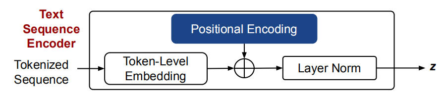
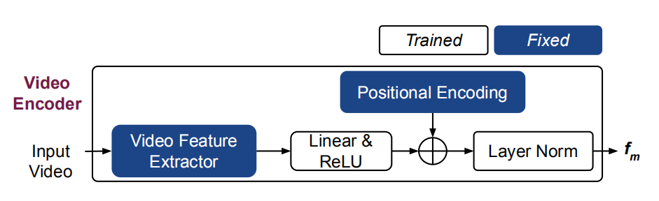

## Video-Grounded Dialogue Systems(VGDS)——基于视频的对话系统

- 与传统的基于文本或基于图像的对话系统相比，此任务更具挑战性，因为：
（1）视频的特征空间比基于文本或基于图像的特征空间更大，更复杂，这是因为跨多个视频帧的各种信息（例如背景噪声，人类语音，动作流等）
（2）对话主体必须具有感知和理解来自不同模态的信息的能力（对话历史和人类问询的文本，视频中的视觉和音频特征），并在语义上塑造对人类有意义的响应。

- 大多数用于多模态对话系统的方法都以RNN作为序列处理单元，并以序列到序列网络作为整体架构来对文本中的序列信息进行建模，一些工作采用了查询感知注意力（query-aware attention），使模型专注于与对话上下文最相关的特征的特定部分，尽管有令人鼓舞的结果，但是由于来自多种模态的长期顺序信息的复杂性，这些方法对于处理视频帧不是非常有效或有效率

- 提出了多模态变换网络（MTN），该模型可以对视频帧中的复杂顺序信息进行建模，并且还可以合并来自不同模态的信息。通过共同关注不同表示子空间中的信息，MTN可以对多模态数据（例如视频）进行复杂的推理，并使融合不同模态的信息（比RNN更为容易）

- 受到文本变换成功启发，我们提出了VGDS的新型神经体系结构：
（1）提出使用多头注意力层从视频帧中捕获复杂的顺序信息。多头注意力反复应用于多个模态（视觉，音频，字幕）。这就像一个存储网络，可以使模型在视频上全面推理，以回答人类的提问
（2）提出了一种自动编码器组件，该组件设计为在关注层具有查询意识，以进一步提高模型对输入视频的非文本特征的推理能力
（3）采用训练方法，通过在训练过程中模拟token级别的解码来改善生成的响应

- 在以视频为基础的对话数据集中评估了MTN（通过DSTC7发布）：
在每个对话中，都提供诸如音频，视频和视频字幕之类的视频特征，必须对其进行处理并理解才能进行对话。
进行全面的实验以验证此方法，包括对结果进行自动评估，清洗和定性分析。
验证了此方法应用于基于视觉的对话任务，结果表明MTN可以推广到其他多模态对话系统。

---

## Multimodal Transformer Networks(MTN)——多模态变换网络

- MTN包含3个主要组件：编码器，解码器和自动编码层
（i）编码器层对文本序列进行编码，然后将视频输入为连续的表示形式。位置编码用于分别在令牌和视频帧级别注入输入文本和视频功能的顺序特征
（ii）解码器层投影目标序列，并通过多头注意力机制对多个编码特征进行推理。
注意力层与前馈和残差连接耦合，在传递给生成组件以生成响应之前，在N个注意力步骤上处理投影的目标序列
（iii）自动编码器层通过对输入视频的视觉和音频方面具有查询意识的注意力来增强视频特征。多头注意力层网络被用作查询自动编码器，以无监督的方式学习注意力
我们将这些模块组合为多模态变换网络模型，并端到端地共同训练该模型

- MTN架构

---

## 结论

---

## 其他

https://github.com/henryhungle/MTN  

  

---
