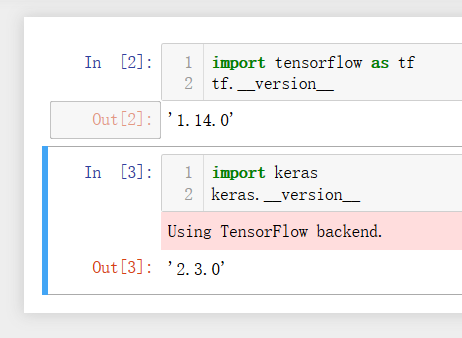

## 安装Anaconda


---
## Anaconda虚拟环境
进入工作目录
```
cd 工作目录
```
建立TensorFlow Anaconda虚拟环境：
```
conda create --name tensorFlow python=3.5 anaconda
```

启动Anaconda虚拟环境
```
activate tensorFlow
```

关闭Anaconda虚拟环境
```
deactivate tensorflow
```

---
## 安装TensorFlow：

启动Anaconda虚拟环境
```
activate tensorFlow
```

安装TensorFlow的CPU版本
```
pip install tensorFlow
```
遇到问题:
- Cannot uninstall 'wrapt'. It is a distutils installed project and thus we cannot accurately determine which files belong to it which would lead to only a partial uninstall.
```
pip install -U --ignore-installed wrapt enum34 simplejson netaddr
```
- distributed 1.21.8 requires msgpack, which is not installed.
```
pip install msgpack
```
```
pip install msgpack-python
```


安装Keras
```
pip install keras
```

---
## 启动Jupyter Notebook
进入工作目录
```
cd 工作目录
```
启动Anaconda虚拟环境
```
activate tensorFlow
```
启动Jupyter Notebook
```
jupyter notebook
```

---
## 测试环境

```
import tensorflow as tf
tf.__version__
```

```
import keras
keras.__version__
```

