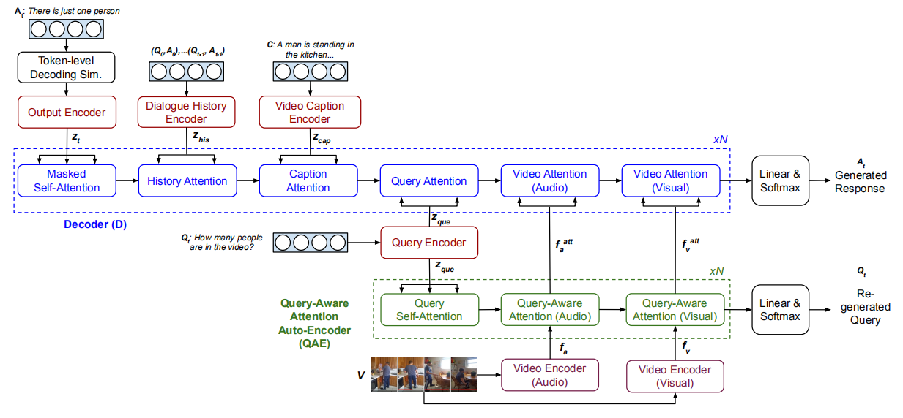

## Multimodal Transformer Networks for End-to-End Video-Grounded Dialogue Systems

MTN——Multimodal Transformer Networks

- Encoder layers encode text sequences and input video into continuous representations. Positional encoding is used to inject the sequential characteristics of input text and video features at token and video-frame level respectively
- Decoder layers project the target sequences and perform reasoning over multiple encoded features through a multi-head attention mechanism. Attention layers coupled with feed-forward and residual connections process the projected target sequence over N attention steps before passing to a generative component to generate a response
- Auto-encoder layers enhance video features with a query-aware attentions on the visual and audio aspects of the input video. A network of multi-head attentions layers are employed as a query auto-encoder to learn the attention in an unsupervised manner

For simplicity, Feed Forward, Residual Connection and Layer Normalization layers are not presented.

---

VGDS
- We propose to capture complex sequential information from video frames using multi-head attention layers. Multihead attention is applied across several modalities (visual, audio, captions) repeatedly. This works like a memory network to allow the models to comprehensively reason over the video to answer human queries
- We propose an autoencoder component, designed as query-aware attention layer, to further improve the reasoning capability of the models on the non-text features of the input videos
- We employ a training approach to improve the generated responses by simulating token-level decoding during training

---
